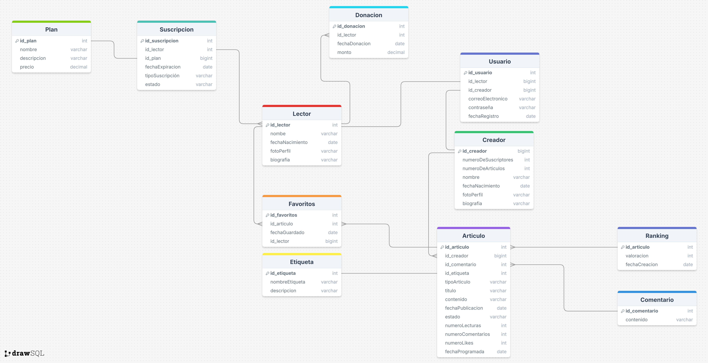

## Introducción

**CommuVerse** es una plataforma web que permite a los creadores de contenido publicar sus artículos y generar ingresos mediante suscripciones y donaciones. Proporciona herramientas de análisis avanzadas para ayudar a los creadores a conocer el impacto de su contenido y su audiencia, todo en un entorno seguro y fácil de usar.

Con el objetivo de garantizar la seguridad de las transacciones y el cumplimiento de normativas locales, CommuVerse ofrece una solución completa para que los creadores puedan monetizar su trabajo, ampliar su comunidad y seguir creando contenido de calidad.

### Colaboradores del Proyecto

| **Nombre**                        | **Rol**                                     | **Perfil**                                                 |
|-----------------------------------|---------------------------------------------|------------------------------------------------------------|
|Stefano Yepez Zapata    |Scrum master| [LinkedIn](https://www.linkedin.com/in/stefano-yepez-zapata-843754243/)           |
| Angelo Sosa Macuyama | Scrum team | [LinkedIn](http://www.linkedin.com/in/angelo-sosa-28800a2a3/)           |
|Pierreluiggi Zevallos Bocanegra   |  Scrum team| [LinkedIn](http://www.linkedin.com/in/rider-pierreluiggi-zevallos-bocanegra-98162a326)           |
|Matias Felipe Alcalde Lavado|  Scrum team| [LinkedIn](https://www.linkedin.com/in/matias-felipe-alcalde-lavado-8a49aa327/)           |
|Clever Aguilar Idrogo| Scrum team| [LinkedIn](https://www.linkedin.com/in/clever-josue-aguilar-idrogo-a1b862307/)           |

### Revisa el Progreso del Proyecto CommuVerse

| **Columna**       | **Descripción**                                                                                                                                    |
|-------------------|----------------------------------------------------------------------------------------------------------------------------------------------------|
| **Backlog**       | Contiene todas las historias de usuario, tareas y características que deben desarrollarse. Es el listado de todo el trabajo pendiente.              |
| **En Progreso**   | Incluye las tareas que están actualmente en desarrollo. Visualiza el trabajo en curso para asegurar el flujo continuo de trabajo.                   |
| **Revisión**      | Después de completar una tarea, se mueve aquí para una revisión de código y revisión por pares (pre review). Esta fase incluye la creación de **pull requests** para asegurar que el código cumpla con los estándares de calidad antes de integrarse al proyecto principal. |
| **En Pruebas**    | Contiene las tareas que han pasado la revisión de código y necesitan pruebas exhaustivas (unitarias, de integración y de aceptación) para garantizar su calidad. |
| **Hecho**         | Las tareas completamente desarrolladas, revisadas y probadas se mueven aquí, indicando que están listas y finalizadas.                               |

Mira cómo va avanzando nuestro trabajo visitando el siguiente enlace: [Tablero de Trello](https://trello.com/b/7DuasOt9/transaccional).

También nos puedes visitar en nuestro canal de youtube: [Canal de Youtube](https://www.youtube.com/@CommuVerseStartup)

### Funcionalidades de la Aplicación CommuVerse

#### **Módulo de Gestión de Usuarios**

- **Creación de Usuarios e Inicio de Sesión:**

    - Permitir a los usuarios registrarse en la plataforma.
    - Facilitar el inicio de sesión para acceder a la cuenta personal.
    - Mantener la seguridad de las credenciales de los usuarios.
    - Notificaciones en tiempo real para responder a los comentarios

#### **Módulo de Gestion Contenidos**

- **Gestión de contenidos:**
    - Los creadores pueden redactar, editar y publicar articulos, con la posibilidad de poner un link de imagen o videos de ser necesario.
    - Organización de articulos mediante categorías para facilitar la búsqueda
    - Permitir a los lectores agregar articulos a una lista de favoritos
    - Comentarios en los articulos, permitiendo la interacción directa entre creadores y lectores

#### **Módulo de Gestion de Monetización**
-
  **Gestión de suscripciones y donaciones**
    - Los creadores pueden habilitar suscripciones mensuales para sus artículos.
    - Opción para que los lectores realicen donaciones únicas a los creadores.
    - Reportes detallados sobre el desempeaño de los articulos: suscripciones generadas.
    

## Diagramas de la Aplicación

Para entender mejor la estructura y diseño de la aplicación "CommuVerse", revisa los siguientes diagramas:

### Diagrama de Clases

### Diagrama de Base de Datos

Este diagrama ilustra el esquema de la base de datos utilizada por la aplicación, mostrando las tablas, columnas, y relaciones entre las entidades.

### Descripción de Capas del Proyecto

| Capa        | Descripción                                                                                  |
|-------------|----------------------------------------------------------------------------------------------|
| api         | Contiene los controladores REST que manejan las solicitudes HTTP y las respuestas.            |
| entity      | Define las entidades del modelo de datos que se mapean a las tablas de la base de datos.      |
| repository  | Proporciona la interfaz para las operaciones CRUD y la interacción con la base de datos.      |
| service     | Declara la lógica de negocio y las operaciones que se realizarán sobre las entidades.         |
| service impl| Implementa la lógica de negocio definida en los servicios, utilizando los repositorios necesarios. |

# Asignación de Historias de Usuario

**Sprint 1:** Funcionalidades Básicas  
  *Enfocado en implementar las funcionalidades esenciales de CRUD para la gestión de usuarios, creadores, lectores, y módulos de contenido y suscripciones, asegurando que el producto permita la publicación y monetización de artículos, ofreciendo un flujo básico de interacción entre creadores y lectores a través de donaciones y suscripciones, para que esté listo para un uso inicial en CommuVerse.*

| Integrante  | Módulo                       | Historia de Usuario                                                   | Descripción                                                                                                                                      
|-------------|------------------------------|----------------------------------------------------------------------|--------------------------------------------------------------------------------------------------------------------------------------------------
| Stefano Yepez Zapata| Gestión de Usuario | HU 01: Crear categorías.                              | Como administrador, quiero poder crear, leer, actualizar y eliminar categorías para mantener organizada la colección de libros.                   
|             | Gestión de Usuario           | HU 02: Iniciar sesión.                                  | Como administrador, quiero poder crear, leer, actualizar y eliminar libros para mantener actualizada la oferta disponible en la plataforma.       
|             | Gestión de Usuario           | HU 03: Editar perfil.                                  | Como administrador, quiero poder crear, leer, actualizar y eliminar libros para mantener actualizada la oferta disponible en la plataforma.       
| Matias Alcalde Lavado| Gestión de monetización      | HU 13: Crear planes de suscripción.                                 | Como administrador, quiero poder crear, leer, actualizar y eliminar información de autores para mantener actualizada la base de datos de autores de libros. 
|             |  Gestión de monetización          | HU 14: Recibir donaciones. | Como administrador, quiero generar reportes de libros filtrados por categoría para obtener información sobre el catálogo disponible.             
|             |  Gestión de monetización          | HU 15: Analisis de ingresos. | Como administrador, quiero generar reportes de libros filtrados por categoría para obtener información sobre el catálogo disponible.             
| Angelo Sosa Macuyama| Gestión de de articulo     | HU 11: Buscar articulo.                            | Como usuario, quiero poder registrarme en la plataforma para acceder a las funcionalidades disponibles.                                           
|             |Gestión de de articulo     | HU 12:Comentar articulo.                             | Como usuario, quiero poder actualizar mi información personal para mantener mis datos al día en la plataforma.                                    
|             |Gestión de de articulo     | HU 16:Calificar articulos con estrellas.                         | Como usuario, quiero poder ver todos los detalles de mi perfil en una sección dedicada para revisar mi información personal y mi historial de actividad en la plataforma. 
| Pierreluiggi Zevallos Bocanegra| Gestión de articulo        | HU 07: Crear articulo. | Como usuario, quiero poder seleccionar libros para comprarlos, simulando el flujo de compra inicial antes de integrar los métodos de pago.       
|             | Gestión de usuario         | HU 04:Recuperar contraseña.       | Como usuario, quiero generar un reporte de mi historial de compras para revisar las transacciones realizadas en la plataforma.                   
|             | Gestión de articulo       | HU 08:Editar articulo.      | Como usuario, quiero generar un reporte de mi historial de compras para revisar las transacciones realizadas en la plataforma.                    
| Clever Aguilar Idrogo| Gestion de articulos | HU 17: Filtrar articulos.      | Como usuario, quiero poder añadir libros a mi colección personal para organizar mis lecturas y favoritos en un solo lugar.                        
|             | Gestión de articulos |HU 18: Agregar favoritos | Como usuario, quiero poder eliminar libros de mi colección personal cuando ya no los necesite o no desee tenerlos en mi lista.                    
|             | Gestión de articulos |HU 18: Agregar favoritos | Como usuario, quiero poder eliminar libros de mi colección personal cuando ya no los necesite o no desee tenerlos en mi lista.                    
